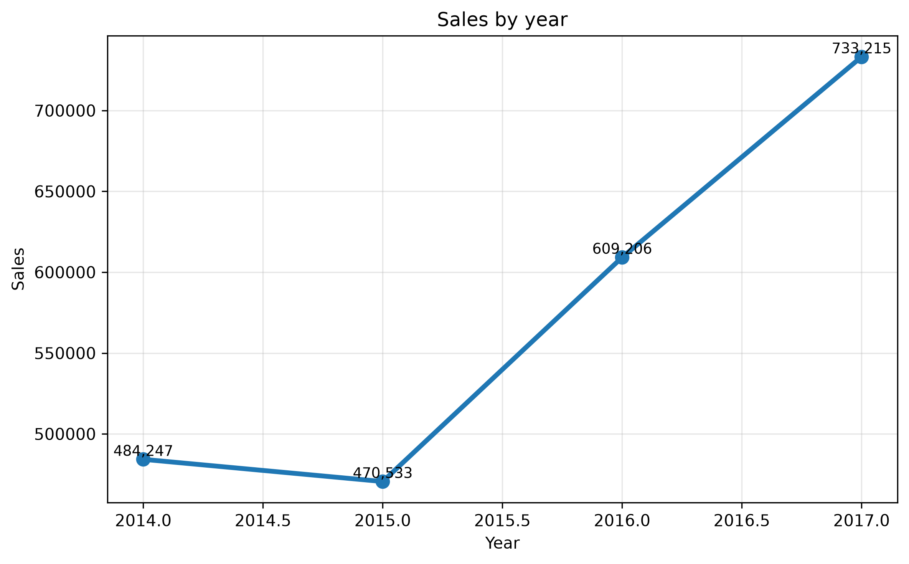
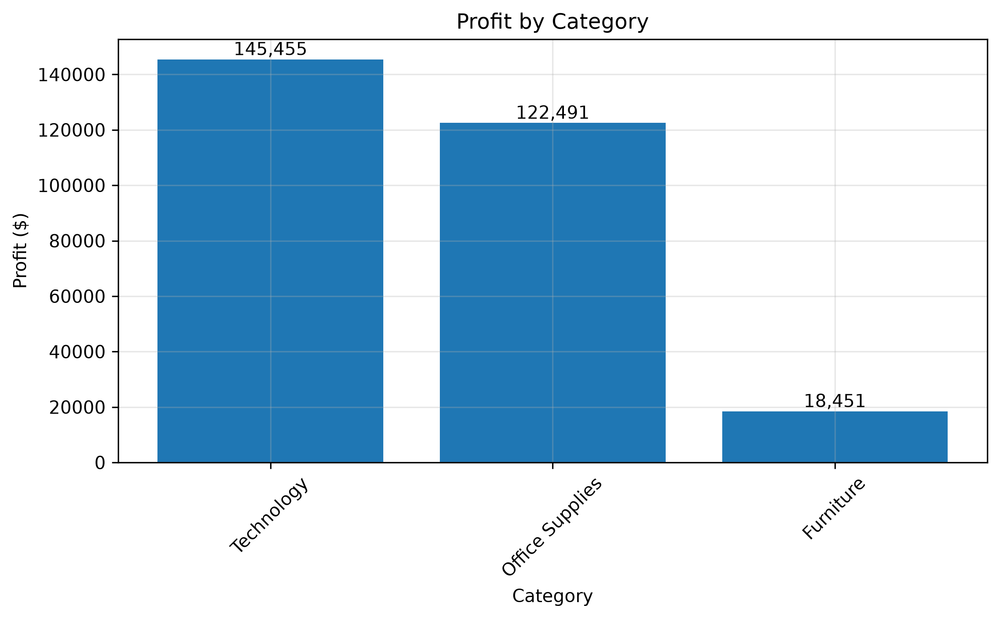
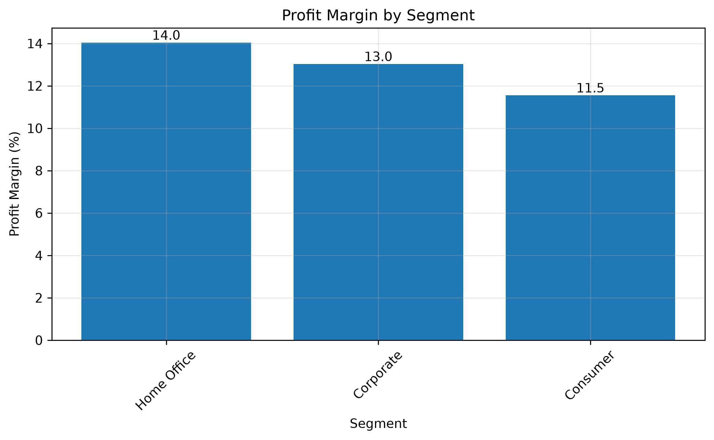
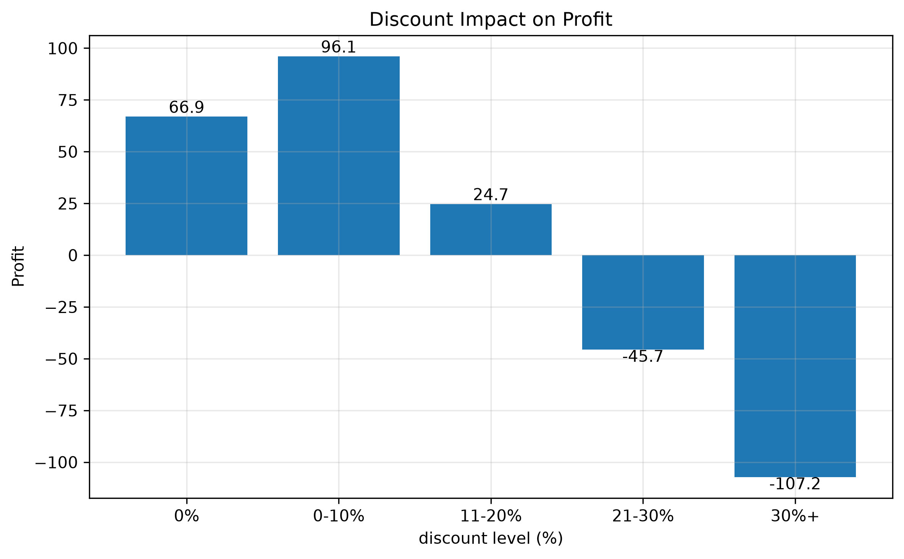
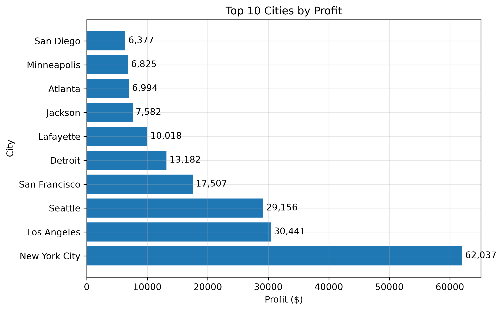
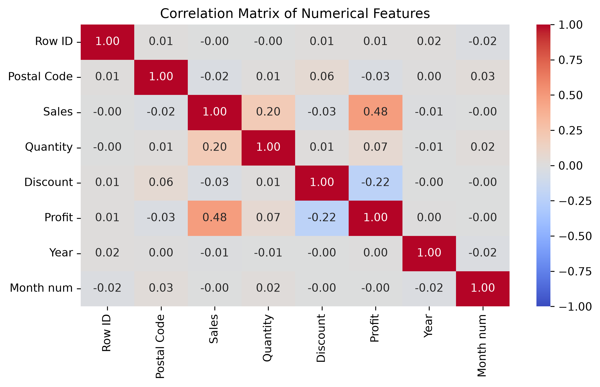
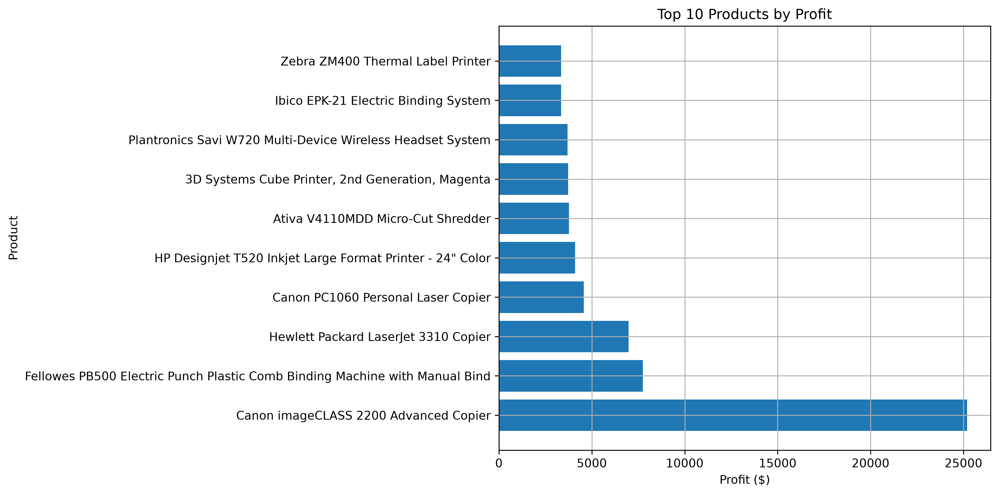
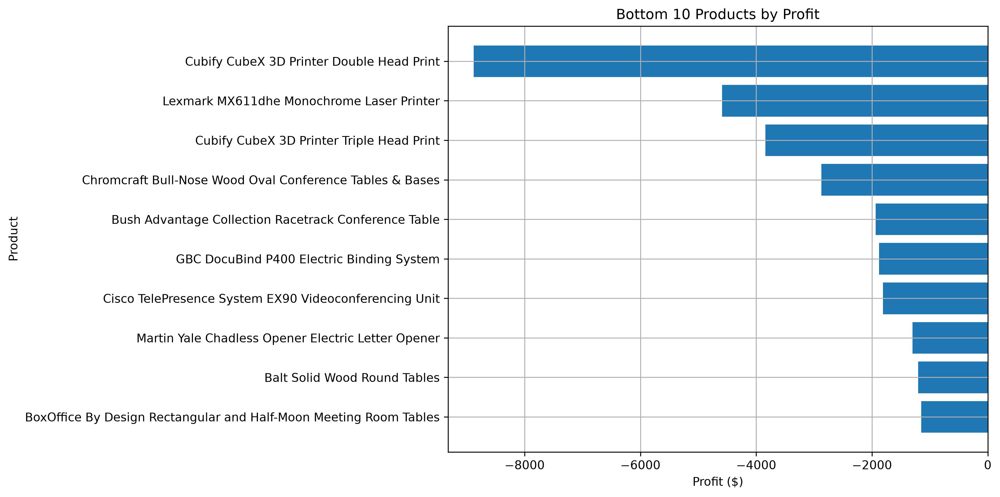

# Sales Superstore Analysis 📊

## Project Overview

This project presents an exploratory data analysis (EDA) of the Sample Superstore dataset.

The main goal is to identify factors influencing sales performance and profitability and provide business recommendations.

## Repository Structure

sales-superstore-analysis/
│
├── data/
│   └── Sample - Superstore.csv
│
├── images/
│   ├── sales_by_year.png
│   ├── profit_by_category.png
│   ├── profit_margin_by_segment.png
│   ├── discount_impact_on_profit.png
│   ├── top_10_cities_by_profit.png
│   ├── correlation_matrix.png
│   ├── top_10_by_profit.png
│   └── bottom_10_by_profit.png
│
├── report/
│   └── Sales_Superstore_Report.docx
│
├── main.py
├── requirements.txt
└── README.md

## Dataset

The dataset contains:

- 9,994 transactions
- 21 features
- Sales information from the USA market

Main features:

- Sales
- Profit
- Discount
- Category
- Sub-Category
- Customer Segment
- City
- Order Date

## Technologies

Python:

- Pandas
- NumPy
- Matplotlib
- Seaborn

## Analysis Performed

The project includes:

- Data quality analysis
- City profitability analysis
- Product category analysis
- Discount impact analysis
- Time trend analysis
- Customer segmentation analysis

## Key Findings

- Technology category generates the highest profit.
- Discounts above 30% significantly reduce profitability.
- Furniture has high sales volume but low profit margin.
- Some cities generate high revenue but require profitability optimization.

## Visualizations

### 1. Sales Trend by Year

This line chart shows yearly sales dynamics from 2014 to 2017.

The visualization demonstrates continuous sales growth over the analyzed period, with the highest sales volume reached in 2017.

### 2. Profit by Category

This bar chart compares total profit across product categories.

Technology and Office Supplies generate the highest profit, while Furniture shows significantly lower profitability despite having a high sales volume.

### 3. Profit Margin by Customer Segment

This bar chart presents profit margin differences between customer segments.

The analysis shows that Home Office has the highest profit margin, while Consumer segment generates the highest sales volume but lower profitability efficiency.

### 4. Discount Impact on Profit

This bar chart analyzes how different discount levels affect profitability.

The results indicate that high discounts, especially above 30%, are associated with negative average profit. Discount strategies should therefore be optimized.

### 5. Top 10 Cities by Profit

This horizontal bar chart presents the most profitable cities based on total profit.

New York City, Los Angeles, and Seattle demonstrate the highest total profit. However, profitability efficiency should also be considered alongside sales volume.

### 6. Correlation Matrix

### 7. Top 10 Products by Profit

### 8. Bottom 10 Products by Profit

## Results

The analysis identified several important business insights:

- Technology is the most profitable product category.
- Furniture has high sales volume but low profitability.
- Discounts above 30% are associated with negative average profit.
- Sales have a moderate positive correlation with profit (r = 0.48).
- New York City, Los Angeles, and Seattle generate the highest total profit.
- Several products consistently generate financial losses and require pricing or inventory review.

## Business Recommendations

Based on the analysis, the following recommendations can be made:

1. Improve Furniture profitability through pricing and cost optimization.
2. Review discount policies, especially discounts above 30%.
3. Focus marketing efforts on highly profitable Technology products.
4. Investigate loss-making products and determine whether they should be repriced or discontinued.
5. Analyze profitability in large cities where sales are high but margins remain relatively low.
6. Continue monitoring seasonal sales trends to improve inventory planning.

---

## Future Improvements

Possible future extensions of this project:

- Interactive Power BI dashboard
- Predictive machine learning models
- Statistical hypothesis testing
- Customer lifetime value analysis
- Sales forecasting